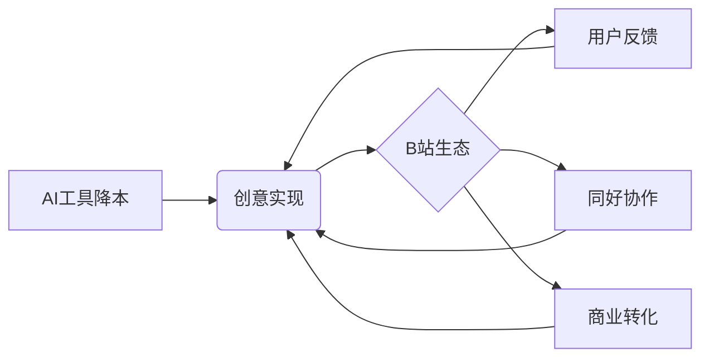

# 精华简报：AI降低创作门槛与B站的生态放大效应

## TL;DR  
B站通过「AI创造公开赛」和Toy平台，展示了AI工具如何将个人创意快速转化为爆款产品（如《世界之门》《万梗捏》），同时凭借社区生态解决获客、迭代等商业化难题，形成"AI降低创作门槛+平台放大影响力"的双轮驱动模式。

---

## 核心洞察  

### 技术维度
1. **AI生产力革命**  
- 案例：单人开发者用1500元/月token成本半年内完成开放世界游戏《世界之门》，传统同类项目需数年团队开发
- 关键技术：Vibe Coding（情绪化编程）、多模态AI识别（助盲眼镜）、生成式交互（NPC AI对话）

2. **平台基建创新**  
- Toy平台提供免服务器部署、自动流量承载能力（如应对SBTI测试突发流量）
- 开发效率：55%作品开发时间≤30小时，83%成本≤500元

### 商业维度
1. **创作者经济新范式**  
- 素人转化率：89%参赛者为万粉以下用户，66%无专业开发背景
- 爆款逻辑：抽象内容（如捏脸游戏《万梗捏》）通过互动性获得300万播放，验证"无用之用"的传播价值

2. **四维商业化闭环**  

&lt;details&gt;&lt;summary&gt;📊 查看 Mermaid 流程图源码&lt;/summary&gt;

&lt;/details&gt;

---

## 行业启示  

### 对平台方
1. **生态位重构**：从内容平台升级为"创意孵化器"，需提供：
   - 低代码开发环境（如Toy平台）
   - 流量冷启动机制（赛事导流）
   - 用户众包体系（如助盲眼镜获上万张标注图片捐赠）

2. **数据资产化**：1.9亿月活AI内容消费者构成精准的:
   - 产品测试池（快速验证创意）
   - 人才储备库（如材料学博士开发游戏）

### 对开发者
1. **微创新机会**：  
- 案例：《元气骑士3D版》仅增加Y轴即实现玩法突破
- 方法论：用AI解构经典产品要素进行重组

2. **冷启动策略**：  
- 情绪价值优先（如"毛骨悚然"的自我震撼）
- 抽象传播杠杆（梗文化裂变）

### 对社会价值
1. **无障碍科技**案例证明：  
- 开源协作可突破技术伦理困境（视障用户直接参与产品设计）
- 小众需求通过社区放大获得商业可行性

---

&gt; 关键数据：B站AI内容消费时长同比+72%，赛事吸引1.34万参赛者，头部作品获496万播放量，验证"工具+社区"模式的规模化潜力。

## 🔗 知识库双向关联
- [The Art of Self-Promotion_简报](/auto-clippings/Auto-简报-The-Art-of-Self-Promotion)
- [The Art of Self-Promotion_全翻译](/auto-clippings/Raw-翻译-The-Art-of-Self-Promotion)
- [🎙️ How I AI How a solo founder used Codex and ChatGPT to lau_简报](/auto-clippings/Auto-简报-🎙️-How-I-AI-How-a-solo-founder-used-Codex)