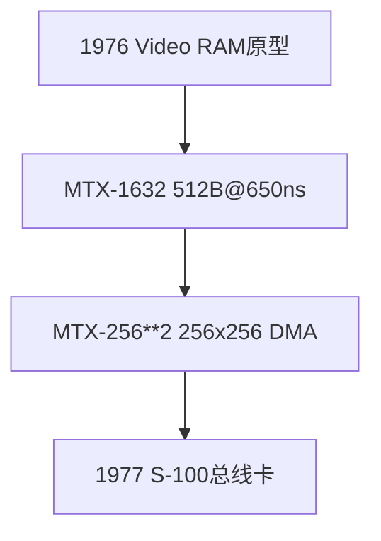

以下是基于该文章的精华分析简报，采用专业分析师框架呈现：

---
**Matrox深度分析简报**

一、**创始背景与战略定位**
1. 创始人特质：
- 洛恩·特罗蒂尔兼具工程师背景（麦吉尔大学工程硕士）与太空科技情怀
- 敏锐捕捉到1970年代CPU与视频接口的蓝海市场（当时主流方案成本&gt;$1000）

2. 差异化定位：
- 初期产品MTX系列（1632/256**2）以"性价比高分辨率"切入专业市场
- 价格锚定策略：$630产品对标DEC GT-40（$14,000）的1/22价格

二、**关键产品演进**

三、**早期增长引擎**
1. 营销创新：
- 垂直媒体精准投放（《电子技术》杂志）
- 产品展会曝光（PC'76接触5000+专业用户）

2. 财务里程碑：
- 首款产品即获$20k订单（相当于2026年$116k）
- 毛利率优势：198美元售价的MTX-1632成本结构未披露，但对比同期96x64套件$100的定价策略

四、**行业环境洞察**
1. 1976年显示技术市场格局：
- 低端：$100级逐点编程方案（96x64）
- 中端：Matrox $630方案（256x256 DMA）
- 高端：DEC $14k系统（1024x768含主机）

2. 战略转折点：
- PC'76展会促使技术路线从独立设备转向S-100总线兼容
- 与苹果同期出道但选择不同赛道（专业vs消费级）

五、**历史启示**
1. 成功要素：
- 技术复用：视频内存技术延展到显示适配器
- 成本控制：DMA接口实现性能价格比突破

2. 当代映射：
- 类似当前DPU芯片厂商的发展路径（从垂直方案到通用接口）
- 专业图形卡市场仍存在相同逻辑（如Blackmagic Design产品矩阵）

六、**待验证假设**
- 早期产品是否采用FPGA前身技术？（文中未明确）
- 与同期厂商Cromemco的技术合作可能性

---
**分析师备注**：Matrox案例揭示了专业硬件厂商的经典成长路径——通过技术降维打击（将航天级技术民用化）和精准市场卡位（介于 hobbyist 与 enterprise 之间）建立竞争优势。其1976年的$20k首单相当于当前12.5万美元种子轮融资，验证了PMF（Product-Market Fit）。