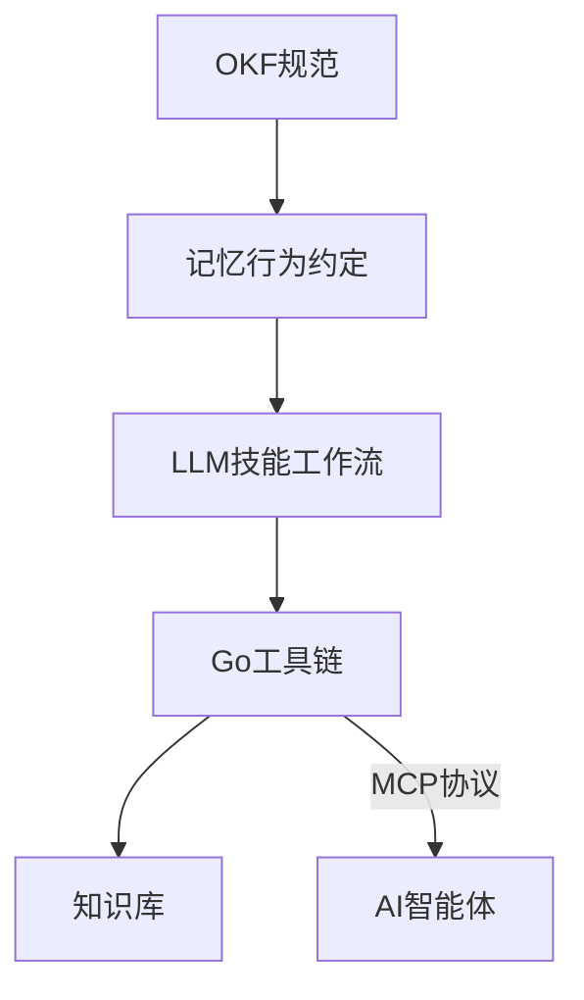

以下为针对《OKF Agent Memory – Git-native persistent memory for AI coding agents》的技术商业精华简报：

---

### **核心价值主张**
1. **解决AI智能体记忆痛点**  
   - 突破LLM上下文窗口限制，通过Git原生存储实现架构决策、领域知识等关键信息的持久化保存
   - 替代传统向量数据库方案，消除黑箱系统风险，提供完全透明、可审计的记忆存储

2. **技术范式创新**  
   - 首创"Markdown+YAML"的标准化知识格式（OKF v0.2）
   - 实现**微秒级检索**（&lt;300µs）与毫秒级验证（~4ms）的性能突破
   - 采用渐进式披露设计，智能动态加载所需知识，降低80% token消耗

3. **商业差异化优势**  
   - **零成本运维**：完全本地化运行，消除向量嵌入API的持续成本（对比传统方案节省$0.1-$0.5/千次查询）
   - **零厂商锁定**：所有知识以纯文本形式存储，兼容现有Git工具链
   - **跨领域通用**：已验证支持软件工程、科研、运维等多场景

---

### **关键技术架构**


1. **五层架构设计**  
   - 标准化格式 → 行为规则 → 提示工程 → 工具链 → 知识库
   - 内置BM25检索算法实现内存级搜索性能

2. **性能标杆对比**  
   | 指标                | 向量数据库方案 | Node.js方案 | OKF方案 |
   |---------------------|---------------|------------|--------|
   | 搜索延迟            | 150-800ms     | 40-120ms   | &lt;300µs |
   | 冷启动时间          | 250-600ms     | 80-180ms   | &lt;4ms   |
   | 内存占用            | 120-350MB     | 60-140MB   | &lt;15MB  |

3. **核心创新机制**  
   - **写前搜索原则**：防止知识重复与幻觉
   - **信任分级系统**：区分AI生成与人工验证内容
   - **生命周期管理**：通过`stale_after`元数据自动标记过期知识

---

### **商业应用前景**
1. **目标市场**  
   - AI辅助开发工具（如GitHub Copilot生态）
   - 企业知识管理系统
   - 科研文献智能分析平台

2. **变现路径**  
   - 企业级支持服务（知识库规模扩展/权限管理）
   - 云托管解决方案（GitHub/GitLab集成插件）
   - 专业领域适配套件（法律/医疗等行业模板）

3. **战略价值**  
   - 构建AI时代的"Git for Knowledge"标准
   - 可能颠覆现有向量数据库在轻量级场景的市场地位

---

### **实施建议**
1. **技术采用**  
   ```bash
   # 快速验证方案
   make benchmark  # 测试本地性能提升
   okf validate --drift  # 知识库健康检查
   ```

2. **商业合作**  
   - 优先切入DevTools赛道，与主流AI编程工具集成
   - 提供知识迁移工具（支持Markdown/Confluence等导入）

3. **风险提示**  
   - 需要团队适应YAML+Markdown的混合编写模式
   - 大规模知识库（&gt;10万条目）的检索性能待验证

---

**结论**：OKF Agent Memory在AI工程化领域实现了突破性创新，其Git原生设计既解决了核心痛点，又创造了新的技术范式，具备成为AI基础设施层关键组件的潜力。建议技术团队优先评估，商业投资者关注其标准化进程带来的生态机会。

## 🔗 知识库双向关联
- [Memory prices up 500 in 12 months_简报](/auto-clippings/Memory-prices-up-500-in-12-months-简报)
- [Memory prices up 500 in 12 months_全翻译](/auto-clippings/Memory-prices-up-500-in-12-months-全翻译)
- [Headlong A Microharness for Persistent Agents_简报](/auto-clippings/Headlong-A-Microharness-for-Persistent-Agents-简报)