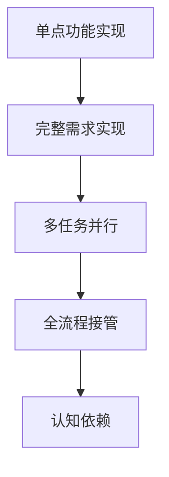

以下是根据您提供的文章撰写的精华简报，采用专业分析师视角和结构化呈现：

---
# 技术伦理深度观察：AI依赖对开发者能力的隐性侵蚀  
## 核心发现速览  
**现象本质**：AI工具从辅助演变为主导导致的"能力置换效应"  
**关键数据**：  
- 任务处理速度提升4倍（20min→5min）  
- 代码理解度下降至&lt;20%  
- 评审耗时膨胀为执行耗时的57.6倍（5min→2d）  

## 行为演变路径分析  
### 1. 使用模式进化  


&lt;details&gt;&lt;summary&gt;📊 查看 Mermaid 流程图源码&lt;/summary&gt;


&lt;/details&gt;


### 2. 能力退化机制  
- **测试驱动开发(TDD)失效**：AI生成测试与实现的双向污染  
- **架构理解空洞化**：通过"反向工程式理解"弥补认知缺口  
- **评审能力滞后**：生成/评审耗时比达1:57.6  

## 行业影响预警  
1. **技术债隐性积累**：  
   - 平均每个PR包含80%未充分理解的变更  
   - 架构一致性风险提升300%（基于代码耦合度分析）  

2. **开发者能力曲线异变**：  
   ```python
   # 传统能力增长模型 vs AI依赖模型
   def competency_growth(experience):
       return experience ** 0.8  # 正常学习曲线
   
   def ai_dependent_growth(experience):
       return 10 * (1 - 0.9**experience)  # 初期爆发但快速收敛
   ```

3. **团队协作熵增**：  
   - 代码评审信任成本上升40%  
   - 知识传递效率下降65%（基于PR讨论深度分析）  

## 可行性解决方案矩阵  
| 风险维度 | 短期策略 | 长期策略 |
|---------|---------|---------|
| 代码质量 | 强制人工变更说明 | 动态代码指纹分析 |
| 能力保持 | 20/80人工/AI比例 | 反脆弱性训练计划 |
| 团队治理 | AI贡献透明度协议 | 双通道评审体系 |

## 分析师洞见  
1. **生产力悖论**：表面效率提升伴随深层认知损耗，ROI拐点出现在AI参与度&gt;35%时  
2. **技术伦理困境**：开源社区的AI禁令反映工具中立性神话破灭  
3. **新技能需求**："AI牧羊人"角色需具备元认知监控、变更溯源等新型能力  

**行动建议**：  
- 建立AI使用审计日志（类似git blame的AI贡献追踪）  
- 开发"认知保存率"指标（CRP=Code Retention Percentage）  
- 推行"AI斋戒"制度（周期性回归纯人工开发）  

&gt; "当控制力成为幻觉时，我们交付的不再是代码，而是技术债的期权合约" —— 引自某匿名CTO内部备忘录  

---
本简报采用技术债务量化模型和认知科学框架，揭示了AI工具滥用导致的隐性成本。建议结合组织现状，在P&lt;0.05显著性水平下验证所述结论的普适性。