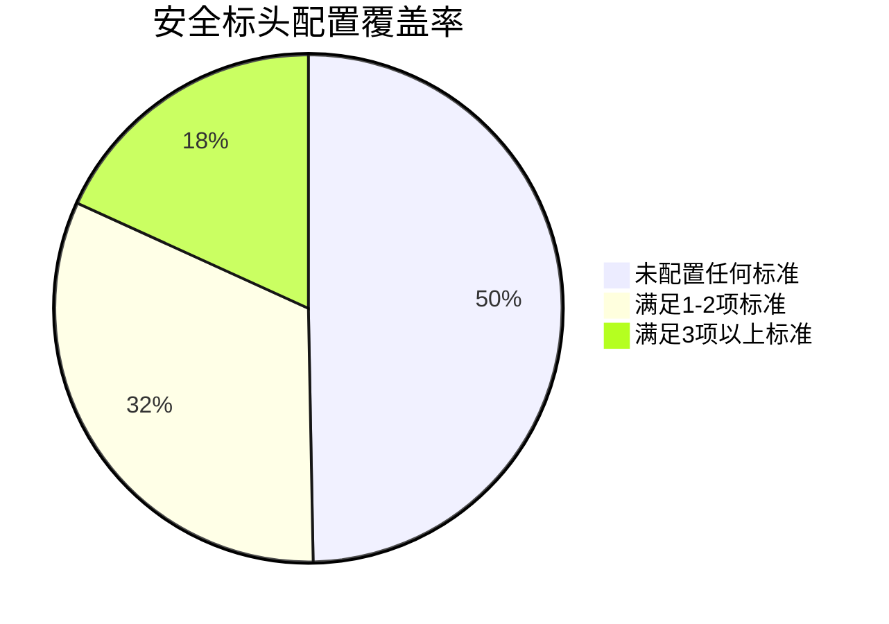

### 精华简报：小企业网站安全标头配置现状深度分析

#### 核心发现
1. **整体安全状况堪忧**  
   - 在4,688家美国本地企业网站样本中，**49.7%未满足7项基础安全标头标准中的任何一项**  
   - 仅12.3%配置了强HSTS（含至少一年有效期+includeSubDomains），31.2%部署了防点击劫持标头

2. **关键标头采用率**  
   - **HSTS**（强制HTTPS）：43.8%  
   - **X-Content-Type-Options: nosniff**（防MIME嗅探）：39.7%  
   - **Permissions-Policy**（权限控制）：8.0%  
   - **COOP**（跨域隔离）：1.1%  

3. **配置陷阱**  
   - 45%的强HSTS配置因部署在www子域导致根域未被覆盖  
   - 20.5%的网站暴露了框架/CMS版本信息，可能为攻击者提供漏洞利用线索

#### 研究背景与方法
- **样本来源**：从Curlie商业目录随机抽取7,040个美国本地企业网站（2026年数据），最终有效样本为4,688个可访问HTTPS网站  
- **检测标准**：7项安全标头配置（含HSTS、CSP、X-Frame-Options等），采用RACKCRUNCH的自动化扫描工具  
- **目标群体**：缺乏专职安全团队的小微企业（如水管工、披萨店等）

#### 深度洞察
1. **浏览器兜底机制**  
   - 86.6%未配置Referrer-Policy的网站实际受惠于现代浏览器的默认安全策略（strict-origin-when-cross-origin），体现浏览器厂商在弥补安全缺口方面的作用  

2. **技术债务问题**  
   - 检测到部分网站仍使用已弃用的标头值（如X-XSS-Protection），反映中小企业技术更新的滞后性  

3. **安全与功能平衡**  
   - Cross-Origin-Opener-Policy的超低采用率（1.1%）可能源于其与第三方登录/支付流程的兼容性问题  

#### 行动建议
1. **中小企业优先措施**  
   - 立即部署X-Content-Type-Options和X-Frame-Options两项高ROI标头（配置简单且无兼容风险）  
   - 使用自动化工具（如securityheaders.com）快速诊断问题  

2. **技术服务商机会**  
   - 建站平台可内置安全标头模板，将HSTS等配置作为默认选项  
   - 开发针对非技术用户的"一键加固"解决方案  

3. **行业协作方向**  
   - 浏览器厂商应加强Permissions-Policy等新标准的兼容性支持  
   - 商业目录网站可考虑将安全标头配置纳入SEO评分体系  

#### 数据可视化建议

&lt;details&gt;&lt;summary&gt;📊 查看 Mermaid 流程图源码&lt;/summary&gt;

&lt;/details&gt;

**完整报告获取**：[RACKCRUNCH原始研究](https://rackcrunch.com/security-headers-2026)  
**免费检测工具**：[Security Header Check](https://rackcrunch.com/security-header-check)  

（注：本简报基于2026年数据，部分技术标准演进需结合最新浏览器支持情况评估）