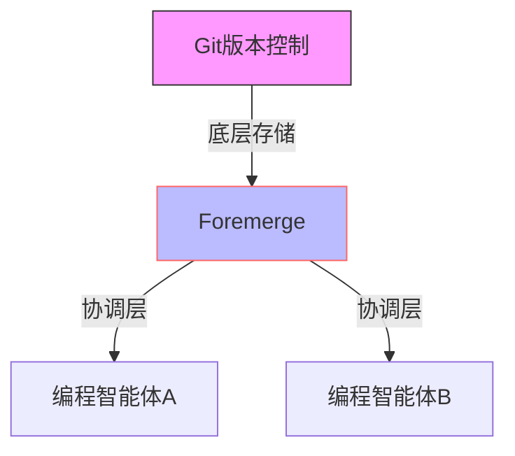

### 精华简报：Foremerge——并行编程智能体意图冲突检测协议

#### 核心价值主张
Foremerge是构建于Git之上的开源协调协议，解决了多AI编程智能体并行开发时的**意图冲突**问题。传统版本控制（如Git）仅能检测文本冲突，而Foremerge通过声明式意图共享，在代码落地前捕捉语义层面的潜在冲突。

#### 技术亮点
1. **声明式协调机制**：
   - 智能体预先声明修改目标（如"修改sendEmail函数"），而非直接提交代码
   - 共享意图数据库存储在.git目录，实现跨智能体（Claude/Codex/Cursor等）实时感知

2. **冲突检测算法**：
   - 基于符号作用域进行语义分析（如PaymentService的替换与扩展）
   - 确定性判断（不依赖模型推理），相同输入始终产生相同结论
   - 提供冲突解释和重构建议（如推荐PaymentProvider抽象层）

3. **非阻塞设计**：
   - 仅提供建议性警告（HIGH级别提示）
   - 不锁定文件或阻塞智能体，避免单点故障影响整体进度

#### 典型应用场景
当两个智能体分别执行：
- 智能体A：将所有支付调用迁移到StripePaymentService
- 智能体B：为原有PaymentService添加PayPal支持

Git会静默合并（因无文本冲突），但Foremerge能提前识别：
❗ 冲突类型：一个移除扩展点，另一个依赖该扩展点
💡 建议方案：基于PaymentProvider接口进行协调

#### 当前阶段
- 版本：0.5.0（Pre-1.0 MVP）
- 已实现核心组件：
  - CLI工具链 + JSON API
  - SQLite存储引擎
  - 验证门控的生命周期管理
- 暂不支持：跨机器协调、基准测试报告

#### 架构定位

&lt;details&gt;&lt;summary&gt;📊 查看 Mermaid 流程图源码&lt;/summary&gt;

&lt;/details&gt;

#### 行业意义
1. 填补了AI协同开发的关键空白：
   - 文本差异检测（Git）→ 语义意图协调（Foremerge）
2. 开启新范式：
   - 从"事后合并冲突解决"到"事前意图协商"
3. 为多智能体软件开发提供基础设施级支持

#### 使用门槛
- 单行命令集成（支持Claude Code/Codex/Cursor等主流AI编程工具）
- 完全兼容现有Git工作流

#### 未来展望
- 跨机器协调能力扩展
- 冲突解决策略市场（可插拔建议引擎）
- 与CI/CD管道深度集成

&gt; 编者注：该项目直击AI结对编程(Pair Programming)的痛点，其"声明优于解析"的设计哲学可能影响下一代开发工具的设计方向。值得技术负责人持续关注其1.0版本演进。