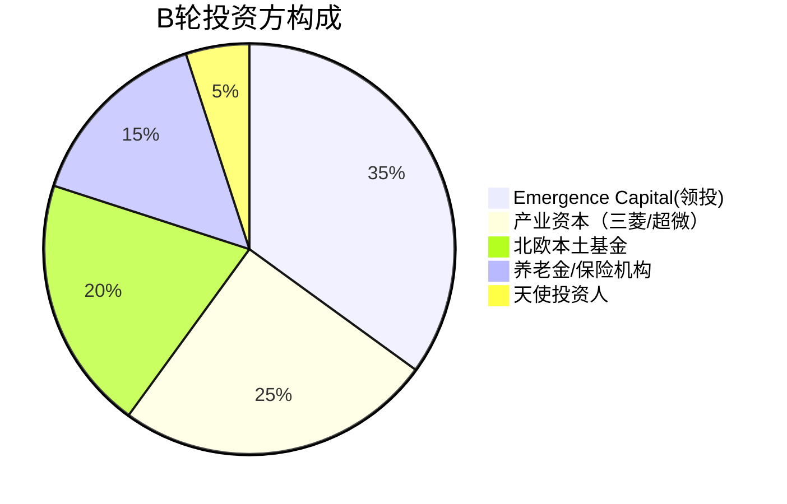

以下是针对Verda公司B轮融资事件的精华分析简报，采用专业分析师框架呈现：

---
# **Verda融资事件深度简报 | 欧洲AI云基建新晋独角兽**

## 一、核心数据速览
- **融资规模**：1.89亿美元B轮（超额认购）
- **估值等级**：新晋独角兽（总融资额超4.5亿美元）
- **财务表现**：年化营收1.65亿美元（2026年7月）
- **基础设施**：2027年规划250MW运营容量
- **市场覆盖**：服务50+国家客户，团队250+人

## 二、战略价值解码
### 1. 赛道定位
**下一代AI云服务商**：解决"动态算力供给"痛点，突破传统静态采购模式，瞄准：
- 突发式Agentic工作负载
- 生产级推理的延迟敏感场景
- 多轮上下文累积的持续训练需求

### 2. 技术护城河
**全栈自主可控架构**：
- **硬件层**：自建数据中心（芬兰+全球扩张）+ 最新NVIDIA芯片部署
- **软件层**：自研编译器/服务系统/AI Lab实时优化（GPU利用率提升30%+）
- **碳效优势**：单位算力碳排放低于行业均值（ESG溢价点）

### 3. 标杆客户验证
| 客户类型       | 使用场景                          | 技术协同深度               |
|----------------|-----------------------------------|---------------------------|
| Aleph Alpha    | 大模型研发基础设施               | 驻场工程师联合开发底层栈   |
| Magnific       | 日均百万级媒体生成请求           | 弹性伸缩承载流量峰值       |
| Epsilon Health | 医学影像AI原生分辨率训练         | 定制集群+数据流系统共研    |

## 三、资本布局深挖
### 投资方战略图谱

&lt;details&gt;&lt;summary&gt;📊 查看 Mermaid 流程图源码&lt;/summary&gt;

&lt;/details&gt;

**资本协同效应**：
- 三菱UFJ：亚洲市场扩张通道
- 超微电脑：硬件供应链支持
- 芬兰Tesi：政府产业政策背书

## 四、行业影响研判
### 市场窗口期判断
- **CEO关键断言**："欧洲建立标杆性计算公司的窗口期≤24个月"
- **数据佐证**：全球AI云服务市场CAGR 28.7%（2023-2027，Tractica）

### 竞品对标分析
| 维度          | Verda               | 传统云厂商         | 专项AI云          |
|---------------|---------------------|-------------------|------------------|
| 响应速度      | 分钟级供给          | 周级审批          | 小时级部署        |
| 定价模型      | 动态竞价+长协混合   | 固定预留实例      | 纯按需计费        |
| 技术穿透力    | 全栈可控至硬件层    | 黑盒API服务       | 有限硬件定制      |

## 五、风险提示
1. **地缘因素**：欧洲数据主权监管可能限制全球扩张
2. **技术迭代**：光子芯片等新型计算架构的颠覆风险
3. **资本效率**：重资产模式下的ROIC需保持＞15%

## 六、分析师洞见
**三维度验证投资逻辑**：
1. **需求真实性**：客户案例显示从"算力采购"向"算力工程"的范式迁移
2. **模式差异性**：唯一实现"芯片-数据中心-平台"全栈控制的欧洲玩家
3. **估值合理性**：当前PS ratio≈10x，显著低于CoreWeave的18x（2026E）

**监测指标建议**：
- 下一季度北美节点上线进度
- NVIDIA VR200实测性能提升%
- 企业客户留存率（当前＞90%）

---
本简报基于公开信息进行专业分析，不构成投资建议。如需更详细的财务模型或技术评估，可提供定制化研究服务。