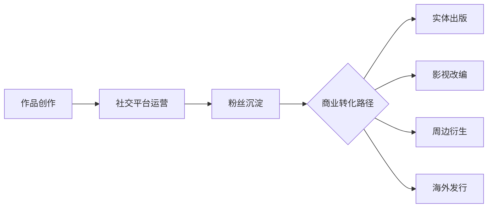

# 精华简报：晋江中腰部作者的流量自救与IP商业化探索

## TL;DR
本文揭示了晋江文学城中腰部作者通过运营个人IP突破流量困境的新趋势，分析了从传统"笔名写作"到"作者真人化"的行业转型，探讨了个人影响力如何赋能作品商业价值，以及机构介入带来的IP全链路开发可能性。

## 核心洞察

### 1. 作者IP化的三大驱动因素
- **流量压力**：晋江站内流量下滑5-10倍，头部作者积分达千亿级vs中腰部仅百亿级
- **版权溢价**：影视改编评估开始参考作者声量（如《撒野》版权收入近亿）
- **粉丝经济**：头部作者如"水千丞"通过188男团系列实现跨媒介开发（广播剧/漫画/影视）

### 2. 运营模式的双轨演进
| 模式类型 | 代表案例 | 优势 | 挑战 |
|---------|----------|------|------|
| **个人运营** | 酥皮芙芙子（2.2万收藏） | 低成本启动，内容自主 | 转化率仅10:1（社交粉→读者） |
| **机构运营** | 星悦文化/星文文化 | 全链路开发（如《莲花楼》码洋1600万+） | 作者需让渡部分创作主导权 |

### 3. 商业化价值链条重构

&lt;details&gt;&lt;summary&gt;📊 查看 Mermaid 流程图源码&lt;/summary&gt;

&lt;/details&gt;

## 行业启示

1. **中腰部作者破局公式**  
   `差异化内容+高频互动+跨界曝光=流量杠杆效应`  
   （例：叒木通过生活化内容提升读者粘性）

2. **平台机制缺陷倒逼创新**  
   - 晋江缺乏算法推荐，老粉投票占比超60%  
   - 导致"马太效应"加剧，中腰部需外部引流

3. **风险收益新平衡**  
   - 收益：头部作者单IP影视版权达千万级  
   - 风险：真人化可能引发作品评价绑架（如甜画舫容貌争议波及作品评分）

4. **机构服务新蓝海**  
   专业经纪公司正切入"IP孵化-开发-运营"全流程，核心能力包括：  
   - 跨平台内容分发（如番茄小说千万级点播运营）  
   - 舆情风险管理（应对作者真人化带来的舆论压力）

## 关键数据
- 头部作者版权收入：墨香铜臭系列超亿元 vs 中腰部平均单本收藏2-4万  
- 转化效率：社交平台万级曝光仅带来数百订阅  
- 开发周期：成熟IP从创作到影视化平均3-5年