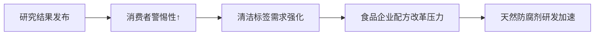

# 精华简报：八种常用食品防腐剂与高血压关联性研究

## TL;DR  
法国一项针对11万余人长达7-8年的观察性研究表明，八种常见食品防腐剂（如E202、E250等）的高摄入量与高血压风险上升24%及心血管疾病风险增加16%存在统计学关联，但需注意该研究仅证明相关性而非因果性。

---

## 核心观点与技术洞察  
1. **关键发现**  
   - **风险增幅**：高防腐剂摄入群体高血压风险↑24%，非抗氧化类防腐剂与心血管疾病风险↑16%  
   - **靶向添加剂**：  
     - 加工肉类：亚硝酸钠(E250)、抗坏血酸盐(E301/E316)  
     - 饮料/水果：山梨酸钾(E202)、柠檬酸(E330)  
     - 酒精类：焦亚硫酸钾(E224)  
   - **作用机制**：非抗氧化类防腐剂通过微生物抑制（而非抗氧化）途径可能影响代谢  

2. **研究局限性**  
   - 观察性研究设计无法建立因果关系  
   - 未控制所有潜在混杂变量（如加工食品中的其他成分）  

---

## 启发与影响  
### 行业影响链  


&lt;details&gt;&lt;summary&gt;📊 查看 Mermaid 流程图源码&lt;/summary&gt;


&lt;/details&gt;


### 具体应对方向  
1. **食品制造商**  
   - 加速开发植物提取物（如紫苏提取物）替代化学防腐剂  
   - 优化包装技术（气调包装/MAP）减少防腐剂依赖  

2. **监管机构**  
   - 可能重新评估E200-E399添加剂安全阈值  
   - 推动加工食品标签的防腐剂含量明示  

3. **投资机会**  
   - 生物防腐技术公司估值提升  
   - 冷链物流企业受益于替代方案需求  

**风险提示**：短期内可能引发针对加工肉制品/饮料板块的ESG争议，但实质性监管变化需等待进一步因果性研究验证。
``` 

注：本简报基于观察性研究结论，实际决策建议需结合后续临床实验与Meta分析结果。关键添加剂E编码已标出以便产业链核查。