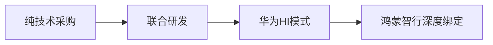

# 精华简报：华为劝车企少做一点

## TL;DR

华为建议车企减少全栈自研，通过专业分工（车企聚焦整车集成/用户运营，供应商提供技术方案）降低研发成本并加速智能化落地，但车企需平衡技术采购与品牌差异化能力构建。

---

## 核心观点与洞察

### 1. 自研成本的经济性悖论

- **长期账单效应**：华为乾崑智驾年研发投入达190亿元，反映智驾系统需持续迭代（软件/算力/硬件），车企自研面临规模分摊难题。

- **隐性成本**：自研可能导致产品延期（时间成本）或功能落后（迭代成本），采购需综合评估适配/验证等隐性支出。

### 2. 供应商规模化复用的商业逻辑

- **华为的规模经济学**：乾崑智驾已搭载200万辆车（第二个百万仅用12个月），通过多品牌复用摊薄研发成本，形成450亿元年收入规模（72%增速）。

- **车企的取舍**：采购可快速获得技术能力，但需接受技术同质化风险（如竞品共享同套方案）。

### 3. 车企的核心能力重构

- **差异化三要素**：

- **技术整合能力**（如比亚迪DMO混动+华为ADS 3.0的组合创新）

- **品牌经营主权**（问界案例显示赛力斯主导产品定义/渠道）

- **用户运营闭环**（反馈机制影响长期竞争力）

---

## 行业启发与影响

### 1. 供应链关系重塑

- **从垂直整合到生态协作**：传统"全栈自研"模式受挑战，Tier1供应商（如华为）将更深度参与整车智能化定义。

- **新博弈焦点**：技术通用性与车企定制化需求的平衡（如华为ADS需支持多品牌快速适配）。

### 2. 车企竞争力迁移

- **关键能力转型**：机械性能（底盘/动力）仍是基础，但用户运营/数据迭代能力成为新护城河。

- **成本结构优化**：年销量&lt;20万的车企或更倾向采购，头部车企可能保留核心算法自研。

### 3. 行业加速分化

- **合作模式光谱**：


&lt;details&gt;&lt;summary&gt;📊 查看 Mermaid 流程图源码&lt;/summary&gt;



- **马太效应加剧**：能实现"技术采购+差异化整合"的车企将拉开差距，中间层面临双重成本压力。

---

&gt; **关键追问**：当L4级智驾成为标配时，车企的品牌溢价究竟靠什么支撑？（设计？服务？生态？）

```

</details>

注：本简报通过成本结构分析、商业模型解构和典型案例对比，揭示了智能汽车产业正在发生的价值链重构逻辑。数据截至2026年9月（文中最新时间节点）。