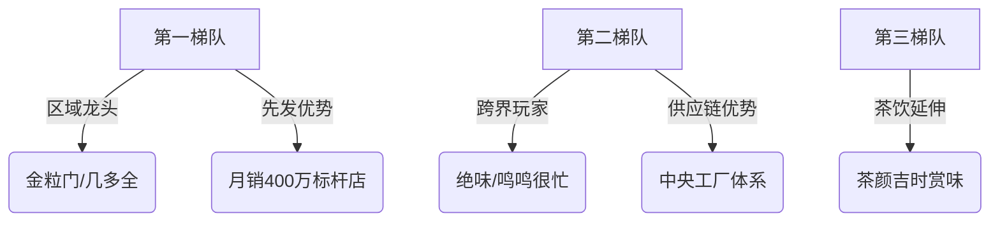

# 精华简报：新鲜零食行业的繁荣与隐忧

## TL;DR
新鲜零食行业凭借"现制现售"概念快速崛起，但面临产品同质化、虚假短保宣传、供应链压力及加盟模式风险等挑战，行业在高速扩张中正遭遇信任危机，亟需解决商业伦理与运营模型可持续性问题。

## 核心洞察

### 1. 行业爆发式增长
- 2026年进入规模化扩张期，40+品牌形成两大阵营：原生品牌(金粒门/几多全等)和跨界品牌(绝味/茶颜悦色等)
- 头部单店月销达150-400万，客单价40-60元(传统零食1.5-2倍)，毛利率30-35%
- 多家品牌筹备A轮融资，估值20-30亿元，红杉等顶级机构关注

### 2. 商业模式争议点
- **新鲜感营销陷阱**：中央工厂预制+门店简单加工的产品占比超50%，却标榜"现制现售"
- **合规性风险**：60%产品未标注配料表，利用"现制现售"法规模糊地带规避监管
- **价格溢价泡沫**：原料稀缺性宣传缺乏独特性，20%+溢价主要覆盖商场租金和场景包装

### 3. 供应链关键挑战
- 短保产品平均损耗率8-15%(传统零食仅1-3%)
- 区域品牌跨区扩张面临配送半径难题：长沙金粒门本地门店密度15家/百平方公里，跨省后降至2家
- 加盟模式单店需400万+投资，月营收30万时回本周期达4年

### 4. 行业结构演变

&lt;details&gt;&lt;summary&gt;📊 查看 Mermaid 流程图源码&lt;/summary&gt;

&lt;/details&gt;

## 启发与影响

### 行业警示
1. **信任危机临界点**：茉酸奶事件表明，成分标注问题可能引发连锁监管反应
2. **加盟模式风险**：头部品牌加盟费150万+，但60%加盟商反映实际ROI低于承诺值
3. **资本过热风险**：参照2023年新茶饮赛道，估值泡沫可能在18个月内显现

### 转型建议
- **供应链升级**：建立半径&lt;200km的分布式鲜食工厂(参考日本7-11鲜食模式)
- **透明化运营**：学习茶饮行业成分标注标准，主动披露关键信息
- **差异化竞争**：开发真正独家工艺(如日本Calbee的鲜切马铃薯技术)

### 投资关注点
⚠️ 需重点验证：
1. 单店模型在非核心商圈的复制性
2. 真实短保产品占比是否&gt;40%
3. 冷链物流成本占营收比(健康阈值应&lt;8%)

&gt; 行业正处于"创新者窘境"：维持新鲜感需要慢工出细活，但资本要求快速扩张。平衡二者关系将决定这个价值300亿的新赛道能走多远。