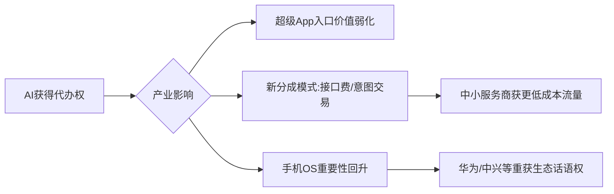

# 精华简报：豆包手机与端侧智能的代办权争夺战

## TL;DR  
豆包手机通过系统级AI助手争夺"代办权"（即代表用户调用服务/完成任务的权限），试图将AI手机竞争从功能堆砌转向任务完成率，但面临应用接口开放、权限分配和商业利益重构等深层挑战，这本质上是手机入口价值与产业秩序的重构。

---

## 核心观点与技术/商业洞察  

### 1. **AI手机竞争进入"代办权"阶段**  
- 竞争焦点从"功能有无"（如修图/翻译）转向"任务完成能力"（如订票/比价）  
- 关键壁垒不再是算力，而是获取调用应用、处理交易的操作权限  
- 中兴豆包手机采用Agent协议替代GUI模拟点击，试图建立合法操作路径  

### 2. **端侧智能的三大误解破除**  
- 不是简单的"云端模型压缩"：需要端云协同架构（本地处理敏感数据+云端复杂推理）  
- 不仅是硬件升级：需整合OS权限/个人数据/应用接口/安全机制  
- 参数大小≠价值：稳定调用服务的能力比模型规模更重要  

### 3. **权限博弈比技术落地更难**  
- 金融/支付类应用因风控已限制AI操作（历史教训：nubia M153被银行应用封禁）  
- 商业矛盾：超级App不愿放弃页面流量入口和广告位  
- 责任划分：误操作导致的损失归属问题尚未解决  

### 4. **入口价值重构的产业影响**  
- 新价值链：AI助手可能成为"应用之前的入口"，重分配流量与佣金  
- 两种合作模式：  
  - **对抗型**：应用厂商自建智能体（如微信小程序AI）  
  - **共生型**：开放API换取更精准的交易意图（降低获客成本）  

---

## 启发与影响  

### 行业启示  
1. **硬件厂商突围路径**：差异化竞争从配置参数转向"任务完成生态"构建能力  
2. **AI价值衡量标准**：需建立"任务成功率/接管率"等新评估体系替代跑分  
3. **权限基础设施需求**：行业可能需要类似"AI操作协议标准"的中间层解决方案  

### 潜在影响链  

&lt;details&gt;&lt;summary&gt;📊 查看 Mermaid 流程图源码&lt;/summary&gt;

&lt;/details&gt;

### 关键观察指标  
- 豆包手机实际支持的高频应用数量  
- 银行/支付类应用的接口开放进度  
- 用户月留存率（是否持续使用代办功能）  
- 是否出现"AI误操作维权"案例  

## 🔗 知识库双向关联
- [当AI开始抽佣：下一代入口的商业模式困局_全翻译](/auto-clippings/Raw-翻译-当AI开始抽佣：下一代入口的商业模式困局)
- [当AI开始抽佣：下一代入口的商业模式困局_全翻译](/auto-clippings/Raw-翻译-当AI开始抽佣：下一代入口的商业模式困局)
- [实测豆包工作：连上飞书后，Agent 终于像个同事了_简报](/auto-clippings/Auto-简报-实测豆包工作：连上飞书后，Agent-终于像个同事了)