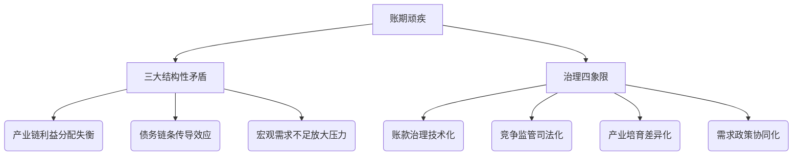

# 精华简报：账期治理是一场持久战

## TL;DR
中国政府近期密集出台政策治理大企业拖欠中小企业账款问题，通过刚性约束和技术手段压缩账期操作空间，但长期积累的产业链结构性矛盾决定了治理需多方协同，是一场需要平衡合规成本与议价能力的持久战。

## 核心洞察
1. **政策升级**  
   - 2023年新政首次将账期治理从软约束（《支付条例》）升级为刚性治理，重点破解"落地难"：  
     - 明确四大付款要素（起算节点/支付流程/验收标准/最长期限）写入合同示范文本  
     - 电子凭证付款期限压缩至6个月，超期禁止融资  
   - 五部委联合监管形成政策合力，较2020年更具系统性

2. **技术治理创新**  
   - 通过数字化手段建立可审计、可监测的闭环：  
     - 电子凭证期限管控与融资挂钩  
     - 验收标准数字化固化（防止事后扯皮）  
   - 将传统"人情账期"转化为标准化金融行为

3. **金融杠杆设计**  
   - 创新性引导大企业将应付账款转为有息负债：  
     - 对合规企业增加融资供给  
     - 允许通过贷款/发债置换应付账款  
   - 实质是将隐性资金成本显性化

4. **博弈论视角**  
   - 揭示账期异化的底层逻辑：  
     - 正常情况：资金成本与议价能力的商事平衡  
     - 当前扭曲：市场权力不对称导致的优势地位滥用  
   - 需配套《反不正当竞争法》第15条司法实践

## 行业影响
1. **制造业深度变革**  
   - 汽车等重点行业60天账期承诺面临执行压力  
   - 电子凭证应用将加速供应链金融创新

2. **合规成本转移风险**  
   - 大企业可能通过压价转嫁合规成本（单价损失替代时间成本）  
   - 中小企业需警惕"明合规暗剥削"的新形态

3. **专精特新机遇**  
   - 政策倒逼中小企业通过技术创新提升议价能力  
   - 技术壁垒型企业将获得相对账期优势

4. **供应链金融重构**  
   - 6个月电子凭证期限催生新型融资产品  
   - 应收账款ABS等工具可能迎来监管套利窗口期

## 持久战逻辑

&lt;details&gt;&lt;summary&gt;📊 查看 Mermaid 流程图源码&lt;/summary&gt;

&lt;/details&gt;
